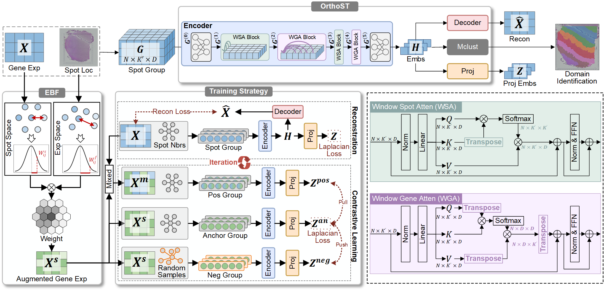

# OrthoST

## Overview
Spatial transcriptomics (ST) technologies jointly capture gene expression profiles and spatial coordinates, providing new insights into tissue organization research. Existing clustering methods effectively exploit spot adjacency to identify domains exhibiting expression consistency and spatial continuity. Despite progress, these methods primarily model spatial adjacency while neglecting complementary gene dependencies and are further hindered by the high sparsity inherent in ST data. Here, we propose OrthoST, a transformer-based method that leverages dimension-orthogonal attention to jointly model spatial and gene dependencies for ST data analysis. By grouping spots into local contexts, OrthoST adapts non-sequential data to transformers and applies window spot attention and window gene attention to capture spatial and co-expression patterns. The model is trained by alternately reconstructing raw data and performing contrastive learning on views augmented by a plug-and-play extended bilateral filtering (EBF), thereby ensuring fidelity and reliable discriminability of embeddings. Extensive experiments across seven diverse ST datasets demonstrate that OrthoST achieves state-of-the-art performance in spatial domain identification, demonstrates strong robustness to dropout events, and effectively captures biologically meaningful gene relationships. These results establish OrthoST as a reliable and effective tool for accurate spatial domain identification, enabling understanding of tissue structure and function.

## Data Availability
All datasets used in this study are publicly accessible. The full original datasets can be obtained from the following sources:
* **HDLPFC**  
  * Data: [https://github.com/LieberInstitute/HumanPilot](https://github.com/LieberInstitute/HumanPilot?tab=readme-ov-file)  
  * Annotation: [Google Drive](https://drive.google.com/drive/folders/10lhz5VY7YfvHrtV40MwaqLmWz56U9eBP)

* **MBA**  
  * [V1_Mouse_Brain_Sagittal_Anterior](https://squidpy.readthedocs.io/en/stable/api/squidpy.datasets.visium.html)

* **HBRCA**  
  * [https://github.com/JinmiaoChenLab/SEDR_analyses/tree/master](https://github.com/JinmiaoChenLab/SEDR_analyses/tree/master)

* **MSC**  
  * [https://linnarssonlab.org/osmFISH/availability/](https://linnarssonlab.org/osmFISH/availability/)

* **MPOR**  
  * [https://zhengli09.github.io/BASS-Analysis/MERFISH.html](https://zhengli09.github.io/BASS-Analysis/MERFISH.html)

* **MVC**  
  * [https://figshare.com/articles/dataset/STARmap_datasets/22565209?file=40038688](https://figshare.com/articles/dataset/STARmap_datasets/22565209?file=40038688)

* **MPFC**  
  * [https://figshare.com/articles/dataset/STARmap_datasets/22565200](https://figshare.com/articles/dataset/STARmap_datasets/22565200)

## Quick Start & Reproducibility
To address the reproducibility concerns, we provide Jupyter Notebooks that include both the source code and the executed outputs for verification.

## Contact
For any questions regarding the code or data, please open an issue in this repository or contact liwei@cse.neu.edu.cn.
